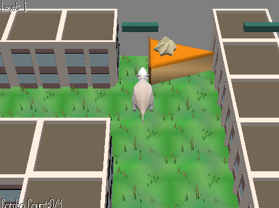

# Find Your Cake

Author: Zhengyang Xia, Fengying Yang

Design: It's a maze but you can gain special power by synchronizing your movement with the beats.

Screen Shot:

How To Play:

Use `WASD` to control the water opossum and find the delicious cheesecake! Listen to the music carefully and try to synchronize the movement with the beats, the water opossum may fly across the buildings after 4 or more combo. 

Sources: 

- Music:

    1. Digital Lemonade by Kevin MacLeod
    Link: https://incompetech.filmmusic.io/song/3648-digital-lemonade
    License: http://creativecommons.org/licenses/by/4.0/

    2. Onion Capers by Kevin MacLeod
    Link: https://incompetech.filmmusic.io/song/4679-onion-capers
    License: http://creativecommons.org/licenses/by/4.0/
    
    3. Tech Live by Kevin MacLeod
    Link: https://incompetech.filmmusic.io/song/4463-tech-live
    License: http://creativecommons.org/licenses/by/4.0/

- 3D Models:
    1. `water opossum` from scenes/garden.blend
    2. `cake` from scenes/brunch.blend
    3. `building` from scenes/city.blend

This game was built with [NEST](NEST.md).

